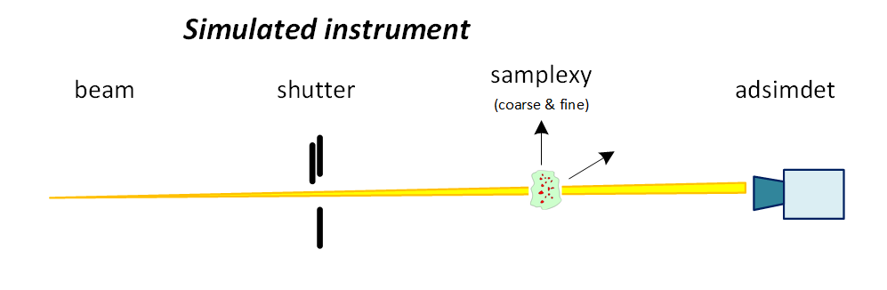
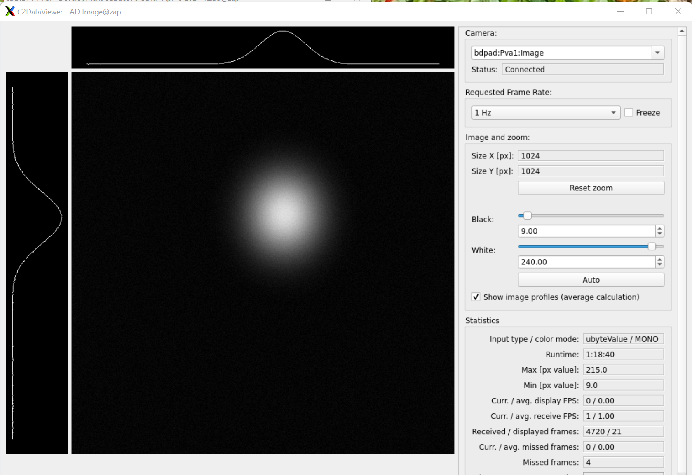
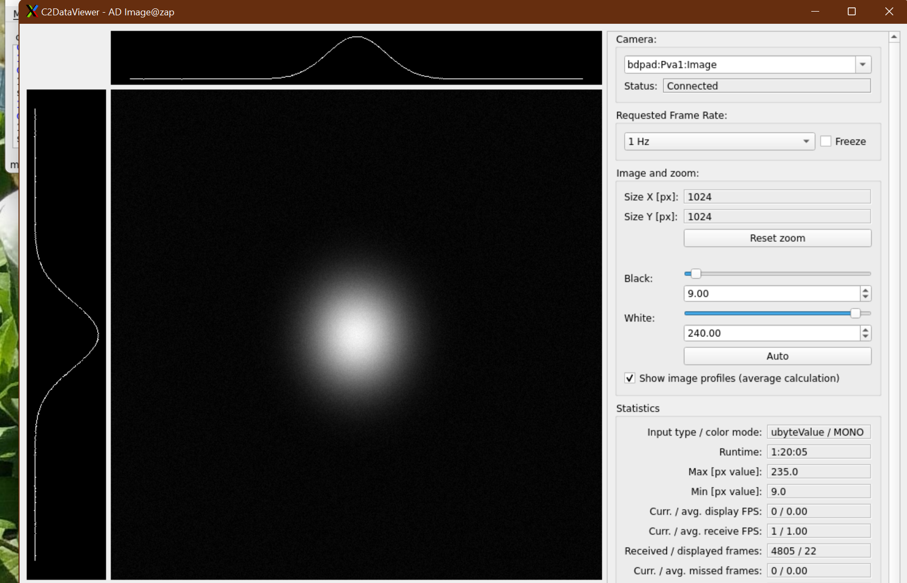

# Game: center the image

Use a game to demonstrate a fully autonomous measurement process.

- [Game: center the image](#game-center-the-image)
  - [Goal](#goal)
  - [Instrument](#instrument)
  - [Rules](#rules)
  - [Model](#model)
  - [Procedure](#procedure)
  - [Tools](#tools)
    - [`bdp` IOC](#bdp-ioc)
    - [`bdpad` IOC](#bdpad-ioc)
    - [`bdpapi` IOC](#bdpapi-ioc)
    - [`c2dv` application](#c2dv-application)
    - [bluesky queue server](#bluesky-queue-server)
    - [bluesky queue server monitor GUI](#bluesky-queue-server-monitor-gui)
    - [local PVaccess data analysis](#local-pvaccess-data-analysis)
  - [Example command-line session](#example-command-line-session)
    - [Start data analysis](#start-data-analysis)
    - [Control the measurements](#control-the-measurements)
    - [Take the next measurement](#take-the-next-measurement)

## Goal

Center the image by adjusting the samplexy fine positioners.

## Instrument



component | description
--- | ---
`beam` | nominal value of 200 with small random noise
`shutter` | *closed* or *open* (affects `adsimdet` image), **note**: *closed* by default
`samplexy` | simulated sample (affects `adsimdet` image)
`adsimdet` | EPICS area detector ADSimDetector with HDF5 and PVA output

The sample simulation produces a single Gaussian 2-D spot (*peak*) placed
randomly on a pixel grid within the frame of the simulated area detector.  The
nominal center and width of the spot are set randomly for each new setup.  The
center is also a function of the samplexy coarse and fine positioners
(controlled by the gain settings of the `new_sample()` plan.  There is an
additional parameter to control a random jitter in the peak position.

## Rules

1. Image(s) and metadata:
   - EPICS PVaccess (streaming)
   - HDF5 file(s)
2. All instrument commands through *queueserver*.
3. Compute *cost* of image as function of fine position and image centroid.
4. Minimize `cost(fx, fy, image)`

## Model

For demonstration purposes, the analysis and decision-making model is purposely
trivial, to demonstrate the autonomous process.

*Later, the analysis and decision-making model will be based on the specific
scientific technique (such as ptychography).*

## Procedure

1. Start a new simulation.
2. Command bluesky queueserver.
3. Read the image from the EPICS PVaccess PV: `bdpad:Pva1:Image`
4. Analyze Image.
5. Decide: execute next measurement (and repeat from 1) or end.

## Tools

- `bdp2202` conda environment
- `bdp` (general purpose synApps xxx-style) IOC running
- `bdpad` ADSimDetector IOC running
- `bdpapi` softIoc running
- `c2dataviewer` conda environment
- `redis` installed (by APS IT) and running on `queueserver` workstation
- `qserver` is running

### `bdp` IOC

Built locally or uses docker.  This is the docker starter:

```bash
start_xxx.sh bdp
```

### `bdpad` IOC

Built locally or uses docker.  This is the docker starter:

```bash
start_adsim.sh bdpad
```

### `bdpapi` IOC

```bash
conda activate bdp2022
cd bdp_controls/feedback
./bdp_feedback.sh checkup
./bdp_feedback.sh status
```

### `c2dv` application

```bash
conda activate c2dataviewer
c2dv --app image --pv bdpad:Pva1:Image &
```

### bluesky queue server

```bash
conda activate bdp2022
cd bdp_controls/qserver
# check that server process is running
./qserver.sh checkup
# process status of server
./qserver.sh status
# status of the qserver internals
qserver status
```

### bluesky queue server monitor GUI

This is optional but can eliminate a lot of typing.

```bash
conda activate bdp2022
queue-monitor &
```

### local PVaccess data analysis

```bash
conda activate bdp2022
cd bdp_controls/qserver
python -m game_client.qs_pva_client
```

## Example command-line session

In a console window, start the PVaccess data analysis process.

### Start data analysis

```bash
(base) prjemian@zap:~$ conda activate bdp2022
(bdp2022) prjemian@zap:~$ cd bdp_controls/qserver
(bdp2022) prjemian@zap:~/.../bdp_controls/qserver$ python -m game_client.qs_pva_client
2022-04-11 15:33:24.027340 657  fine=(17.58, 0.08)  cost=5.741586775338067e-05
qserver queue add plan '{"name": "move_fine_positioner", "args": [16.326292443624368, 0.0009015156939540248]}'
qserver queue add plan '{"name": "take_image", "args": [0.01]}'
qserver queue start
######################################## to restart simple simulation...
qserver history clear
qserver queue clear
qserver queue add plan '{"name": "prime_hdf_plugin"}'
qserver queue add plan '{"name": "move_fine_positioner", "args": [0, 0]}'
qserver queue add plan '{"name": "new_sample", "args": [0, 1, 0]}'
qserver queue add plan '{"name": "open_shutter"}'
qserver queue add plan '{"name": "take_image", "args": [0.01]}'
qserver queue start
```

Ignore the lines before the `###` line, they are from a previous measurement.
The analysis code suggest the next `qserver` commands to make a *new sample* and
take the first image.

The `new_sample(0, 1, 0)` command sets the simulation to only consider the fine
positions in the peak position on the image.  (The arguments are: 0 for the
coarse gain, 1 for the fine gain,, and 0 for the pixel jitter.  The gain is in
units of image pixels per axis unit.)

### Control the measurements

**Note**:
    In the future, these steps will be integrated with the
    remote data analysis client.

In a *new* console window, setup to talk with the queueserver:

```bash
conda activate bdp2022
cd bdp_controls/qserver
```

Type all these commands.  (Copy & paste is easy.) Some of these of commands will
return results (formatted in JSON). Don't bother reading the results unless you
see a log of `'success': False` messages.  Just hope for the best.

Watch the queueserver monitor GUI for continuous status updates.

```bash
qserver history clear
qserver queue clear
qserver queue add plan '{"name": "prime_hdf_plugin"}'
qserver queue add plan '{"name": "move_fine_positioner", "args": [0, 0]}'
qserver queue add plan '{"name": "new_sample", "args": [0, 1, 0]}'
qserver queue add plan '{"name": "open_shutter"}'
qserver queue add plan '{"name": "take_image", "args": [0.01]}'
qserver queue start
```

You should see your first *spot* image in the *C2DataViewer* GUI once the
`take_image()` plan has completed.  You might need to press the *Auto* button
and then the *Reset zoom* button.  The *Show image profiles (average
calculation)* checkbox is a good thing to check.

Once the new image has been taken, the data analysis terminal will analyze the
image and provide a suggestion for the next measurement (or announce that the
goal has been reached).



This line from the analysis shows the date & time of
the image, the `uniqueId` of the image, the fine positioner values, and the
computed *cost* of the fine position.  Here, the cost is the RMS difference
between fine position and measured image centroid, weighted by the measured peak
width, summed over both axes.  The objective is to find the fine position with
the lowest cost.

```
# 2022-04-11 16:15:00.042819 662  fine=(0.00, 0.00)  cost=0.7116396874694153
```

### Take the next measurement

```bash
qserver queue add plan '{"name": "move_fine_positioner", "args": [-57.00319344736647, 133.0588396624472]}'
qserver queue add plan '{"name": "take_image", "args": [0.01]}'
qserver queue start
```

The image shows that the peak is now centered.



The report from data analysis confirms that the goal has been reached.

```
# 2022-04-11 16:17:32.973602 663  fine=(-57.00, 133.06)  cost=1.4368629235352791e-06
# !!! goal has been reached !!!
```
